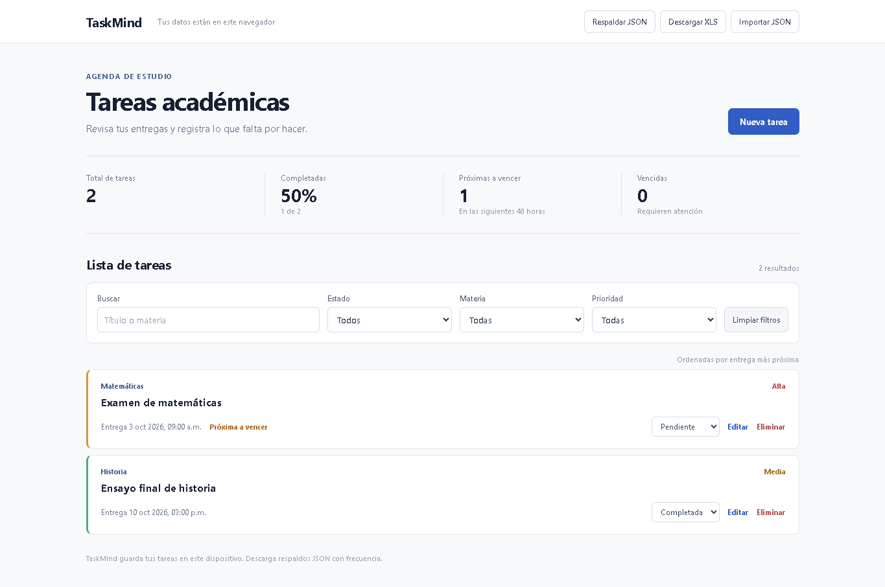
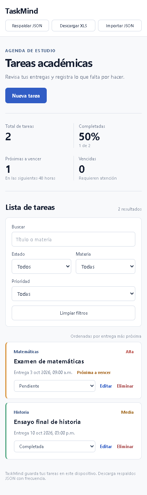

# Documentación técnica de TaskMind

## Contexto del problema

Un estudiante suele repartir sus entregas entre cuadernos mensajes y plataformas distintas. TaskMind reúne las fechas de entrega en una agenda sencilla y muestra el trabajo pendiente al abrirla. El reto pide que los datos permanezcan en el navegador y que la aplicación no dependa de una base de datos externa.

## Solución

La aplicación permite registrar el título la materia la fecha y hora la prioridad y el estado de cada tarea. La lista se ordena por fecha de entrega y puede filtrarse. El panel muestra el total el porcentaje completado las tareas que vencen en las siguientes 48 horas y las vencidas.

La exportación JSON produce un respaldo que también puede importarse. La descarga XLS sirve para revisar las tareas en Excel. El archivo XLS no se utiliza para restaurar datos porque no conserva todos los metadatos de cada tarea.

## Arquitectura

El navegador descarga archivos estáticos desde GitHub Pages. TypeScript gestiona la interfaz y escribe los datos en `localStorage`. Un trabajador de servicio conserva los archivos de la aplicación para abrirla sin conexión después de la primera visita. Los respaldos se descargan directamente desde el navegador.

```text
GitHub Pages
      │
      ▼
Archivos HTML CSS y JavaScript
      │
      ▼
Navegador del estudiante
      │
      ├── Interfaz y filtros
      ├── localStorage para tareas
      ├── Caché para recursos de la aplicación
      └── Descargas JSON y XLS
```

No se envían tareas a GitHub Pages ni a otro servicio. El alojamiento recibe las solicitudes normales para entregar los archivos de la aplicación.

## Modelo de datos

Cada tarea contiene un identificador título materia fecha y hora local de entrega prioridad estado fecha de creación y fecha de actualización. El respaldo JSON incluye una versión de formato para validar importaciones futuras. La importación rechaza estructuras inválidas y solicita confirmación antes de reemplazar las tareas existentes.

## Wireframe de escritorio

```text
┌──────────────────────────────────────────────────────────┐
│ TaskMind             Respaldar   XLS   Importar          │
├──────────────────────────────────────────────────────────┤
│ Tus entregas bajo control          Nueva tarea           │
├─────────────┬─────────────┬─────────────┬────────────────┤
│ Total       │ Completadas │ Próximas    │ Vencidas       │
├─────────────┴─────────────┴─────────────┴────────────────┤
│ Buscar        Estado       Materia       Prioridad       │
├──────────────────────────────────────────────────────────┤
│ Tarea   Entrega   Estado   Editar   Eliminar             │
│ Tarea   Entrega   Estado   Editar   Eliminar             │
└──────────────────────────────────────────────────────────┘
```

## Wireframe móvil

```text
┌──────────────────────────┐
│ TaskMind                 │
│ Respaldar XLS Importar   │
├──────────────────────────┤
│ Tus entregas bajo control│
│ Nueva tarea              │
├────────────┬─────────────┤
│ Total      │ Completadas │
├────────────┼─────────────┤
│ Próximas   │ Vencidas    │
├────────────┴─────────────┤
│ Buscar                   │
│ Estado       Materia      │
│ Prioridad                │
├──────────────────────────┤
│ Tarea                    │
│ Entrega y acciones       │
└──────────────────────────┘
```

## Capturas





## Herramientas utilizadas

TypeScript y Vite generan el sitio. La biblioteca SheetJS crea el archivo XLS en el navegador. Playwright con Chrome permitió comprobar los flujos principales y tomar las capturas. GitHub aloja el código fuente y GitHub Pages publica los archivos compilados. Codex basado en GPT 6 ayudó a diseñar escribir y revisar la solución.

## Verificación

Se comprobó la creación de tareas la edición el cambio de estado la eliminación la persistencia tras recargar los filtros la descarga JSON la importación y la firma binaria del archivo XLS. También se revisaron las vistas de escritorio y móvil.

## Limitaciones y conclusiones

Los datos no se sincronizan entre dispositivos. La navegación privada el borrado de datos el cambio de dirección o los límites de almacenamiento pueden hacerlos desaparecer. Por eso el respaldo JSON es importante. El enfoque local permite gestionar las tareas sin cuenta y sin un servicio de datos que deba mantenerse.
